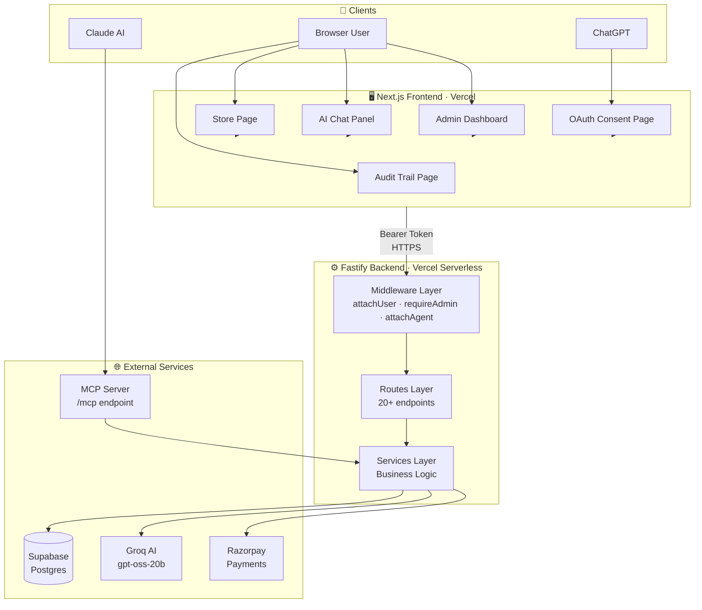
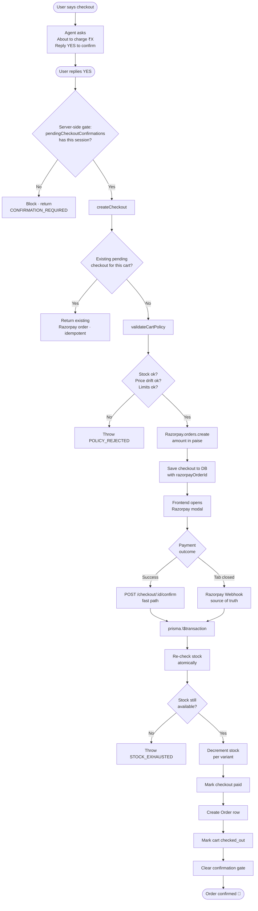
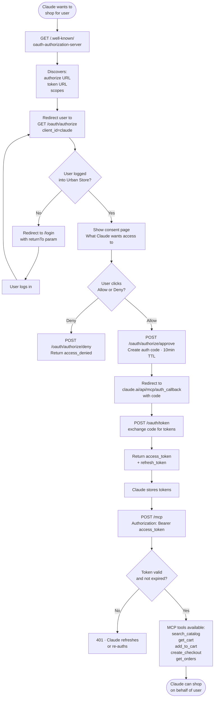
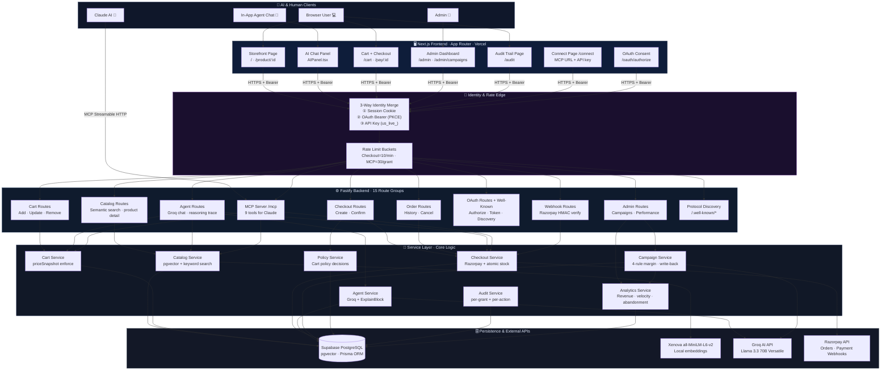
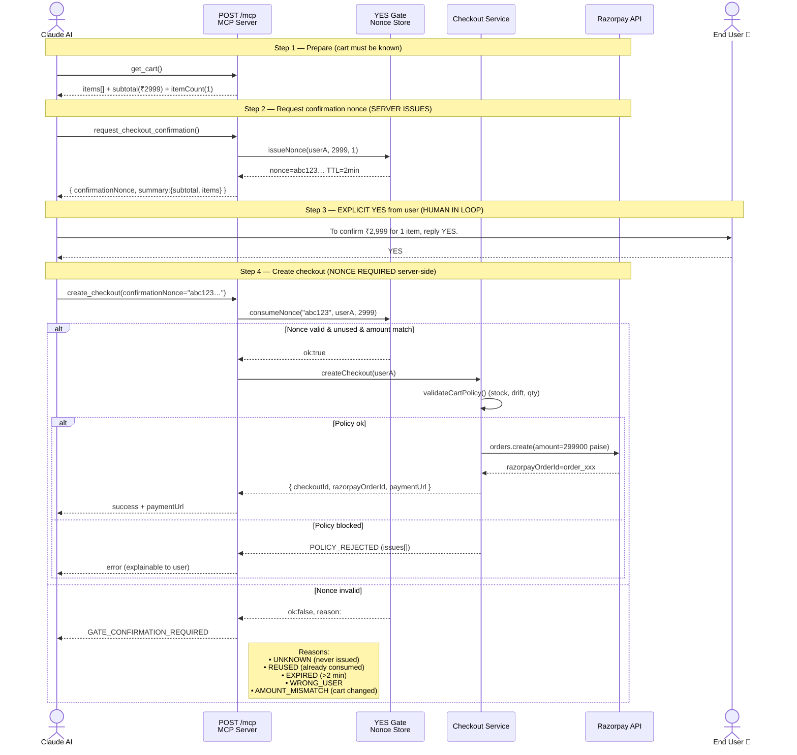
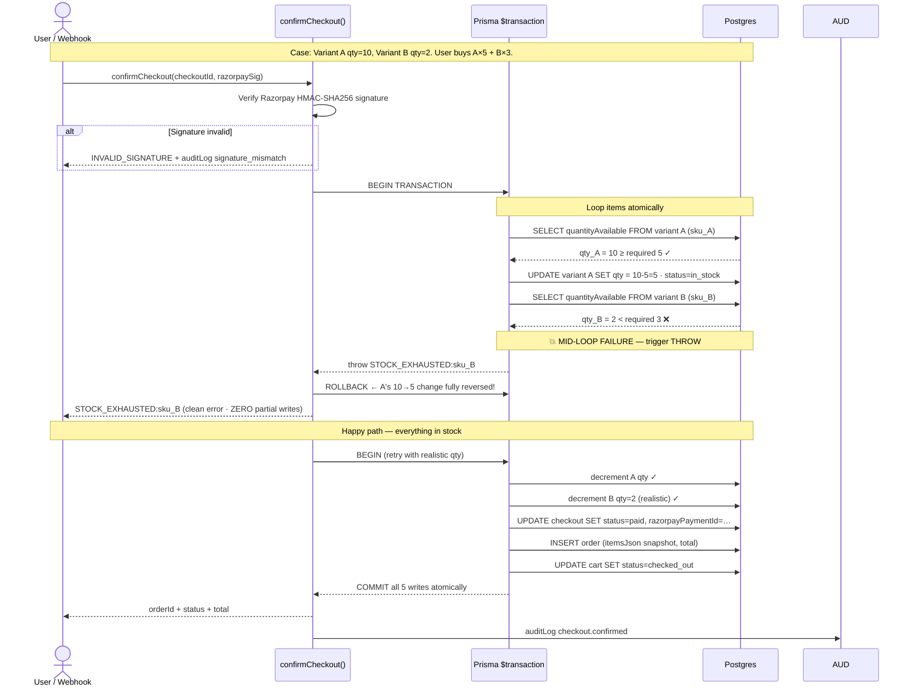

# Urban Store — System Flowcharts

> Open this file in VS Code with the **Markdown Preview** or install the **Mermaid Preview** extension to view the diagrams.

---

## 1. Overall System Flow



---

## 2. User Authentication Flow


---

## 3. AI Agent Chat Flow


---

## 4. Add to Cart Flow


---

## 5. Checkout & Payment Flow



---

## 6. OAuth Flow — Claude Connecting to Urban Store



---

## 7. Admin Dashboard Flow


---

## 8. Data Flow — Product Search to Order

```mermaid
flowchart LR
    A[urban_store_catalog.json\n504 products] -->|npm run seed\nbulk upsert 50 at a time| B[(Supabase DB\nproducts + variants)]

    B -->|keyword search\nPrisma findMany| C[Search Results]
    C -->|formatProduct\nprice · image · availability| D[Product Cards\nin frontend]

    D -->|user adds to cart\n$transaction| E[(cart_items\nwith priceSnapshot)]

    E -->|policy check\nRazorpay create| F[Checkout\n+ razorpayOrderId]

    F -->|payment success\n$transaction| G[(orders\nitemsJson snapshot)]

    G -->|getDashboardSnapshot| H[Admin Analytics\nRevenue · Top selling\nSlow moving]
```



---

## 9. Track 01 — Overall System Architecture (AI Buyer + Revenue Growth)

> **Scope:** All major layers: clients, frontend, identity/rate edge, backend route groups, service layer, and persistence. Shows how 3 AI-buyer identity paths (OAuth PKCE / API key / session) merge into a single enforcement model; how 6 route groups funnel into 8 core services; and how Razorpay + Groq + local embeddings connect as external APIs.



---

## 10. MCP YES-Gate Checkout (Server-Enforced Nonce Flow)

> **Scope:** Sequence diagram of the 3-step MCP money gate. Critical because the security boundary lives in code: Claude cannot fabricate the nonce, the nonce auto-invalidates on cart-change, and 5 failure modes are all explicit server-side reasons. Also shows the policy + Razorpay sub-paths after the gate passes.



---

## 11. Campaign Revenue-Growth Closed Loop

> **Scope:** Data → AI propose → 4-rule margin check → 2nd deep-check → price write → customers buy → actuals measured → write-back → verdict (ahead/on_track/behind) → aggregate accuracy. Explicitly shows the "close the loop" part most AI marketing demos skip.

```mermaid
flowchart TD
    A[Admin triggers /campaigns/generate] --> B[Pull real store data]
    B --> B1[slowMovingProducts · sellThrough %]
    B --> B2[productVelocity · units sold · revenue]
    B --> B3[cartAbandonment · rate · valueAtRisk]
    B --> B4[stockHealth · lowStockAlerts]
    B --> B5[revenueStats · 30 day AOV]
    B1 & B2 & B3 & B4 & B5 --> C[Groq with strict rules prompt]
    C --> D[Parsed JSON campaigns · 3-5 proposals]
    D --> E[Campaign rows · status=pending]

    E --> F{Admin action}
    F -->|Dismiss| G[status=dismissed]
    F -->|Approve| H[validateCampaignPricing<br/>4 rules PRE-CHECK]

    H --> I{Pass all 4 rules?}
    I -->|No · e.g. MIN_EFFECTIVE_MARGIN_5_PCT| J[Throw CAMPAIGN_MARGIN_POLICY<br/>show specific rule + ₹numbers]
    I -->|Yes| K[executeCampaignAction<br/>DEEP-CHECK per variant]

    K --> L{Per-variant deep-check ok?}
    L -->|No| M[auditLog campaign_policy_rejected<br/>ABORT price mutation]
    L -->|Yes| N[Update variant.priceAmount · write _originalPrices snapshot · update active cart priceSnapshots]
    N --> O[status=active · expiresAt=+7d]

    O --> P[Storefront renders campaign]
    P --> Q[Customers buy · Order rows created]
    Q --> R{Lazy 1h refresh on admin view<br/>OR Campaign expired}
    R --> S[persistCampaignOutcomes]

    S --> S1[Read projected.{units, revenue, netGain}]
    S --> S2[Sum actuals from Order.itemsJson<br/>scoped to productId + approvedAt window]
    S1 & S2 --> T[Compute: deltaRevenue · deltaUnits · projectionAccuracy 0..1]
    T --> U[Write actualResults + projectionAccuracy + lastMeasuredAt to Campaign row]
    U --> V[Build performance card]
    V --> W{Verdict}
    W -->|≥+15% delta| X[ahead · extend 2-3 days]
    W -->|±15%| Y[on_track · continue to day 5]
    W -->|<-15%| Z[behind · investigate discount depth / trigger / season]
    W -->|<1 day active| AA[insufficient_data · check tomorrow]

    X & Y & Z --> AB[getCampaignProjectionSummary · aggregate accuracy 0..1 for ALL campaigns]
    Z -->|Dismiss & replace| F

    style A fill:#0ea5e9,stroke:#0369a1,color:#fff
    style C fill:#a78bfa,stroke:#7c3aed,color:#fff
    style H fill:#f59e0b,stroke:#b45309,color:#fff
    style K fill:#f59e0b,stroke:#b45309,color:#fff
    style S fill:#22d3ee,stroke:#0891b2,color:#fff
    style W fill:#10b981,stroke:#047857,color:#fff
```

---

## 12. Atomic Checkout + Stock Rollback (Graceful Failure)

> **Scope:** Sequence diagram of the concurrent-checkout failure case. Variant A has stock=10, Variant B has stock=2. User buys A×5 + B×3. A's decrement succeeds inside the `$transaction`, then B exhausts. **Everything rolls back — A is restored to 10, no partial writes, no oversell.** Also shows the happy path and signature/HMAC branch.



---

## 13. AI-Buyer Identity — 3 Paths to Audit-Ready Enforcement

> **Scope:** How all 3 AI-buyer identity paths (OAuth PKCE for Claude, personal API key `us_live_`, session cookie for in-app) resolve into a single user+grant identity, then feed 3 downstream enforcement points: AuditLog agentGrantId, rate-limiting keyed by grant-id, and the YES-nonce bound to userId.

```mermaid
flowchart LR
    subgraph PATHS["3 AI-Buyer Identity Paths"]
        direction LR
        P1[1. OAuth 2.0 + PKCE<br/>Claude Desktop flow]
        P2[2. Personal API Key<br/>us_live_ prefix · MCP URL]
        P3[3. Session Cookie<br/>In-app chat]
    end

    subgraph RESOLVER["Identity Resolver (MCP + Agent)"]
        R1["Bearer token?<br/>validateAccessToken(oauth)"]
        R2["X-Api-Key header<br/>or ?key= query"]
        R3["Signed cookie"]
    end

    subgraph SCOPED["Scoped Per-Agent Access"]
        G[OAuthGrant row · id · scopes[] · expiresAt]
        U[User row · id · isAdmin]
    end

    subgraph ENFORCED["Every Request Enforced"]
        AUD[AuditLog.agentGrantId → G.id]
        RL[Rate limit keyed by grantId]
        YG[YES nonce bound to userId]
    end

    P1 --> R1
    P2 --> R2
    P3 --> R3
    R1 --> G & U
    R2 --> U
    R3 --> U
    U --> AUD & RL & YG
    G --> AUD & RL

    style PATHS fill:#0f172a,stroke:#25345c,color:#e4ecff
    style RESOLVER fill:#1a0f2e,stroke:#581c87,color:#e4ecff
    style SCOPED fill:#0e1d3a,stroke:#334155,color:#e4ecff
    style ENFORCED fill:#111827,stroke:#25345c,color:#e4ecff
```

---

## 14. Campaign Margin Floor — 4 Rules × 2 Enforcement Points

> **Scope:** The 4 sequential margin rules (URGENCY badge-only, no price increases, max 70% discount, min 5% effective margin). Then the critical "defense-in-depth" pattern: same 4-rule validator runs at approve-time AND again immediately inside the price-update loop (against each individual variant, not just the first). If the deep-check fires, the mutation is aborted and a policy_rejected audit event is written.

```mermaid
flowchart TD
    IN[Campaign proposal arrives] --> C0[For product's first variant]
    C0 --> P1[Rule 1: URGENCY type<br/>MUST NOT carry discountPercent?]
    P1 -->|Violation| R1[❌ URGENCY_MUST_NOT_SET_PRICE<br/>URGENCY is badge-only psychology]
    P1 -->|OK| P2[Rule 2: finalPrice <= basePrice?]
    P2 -->|finalPrice > basePrice| R2[❌ PRICE_INCREASE_NOT_ALLOWED<br/>Campaigns only decrease]
    P2 -->|OK| P3[Rule 3: finalPrice >= basePrice × 0.30?]
    P3 -->|Below 30% of base| R3[❌ MAX_DISCOUNT_70_PCT<br/>No steeper than 70% off]
    P3 -->|OK| P4[Rule 4: finalPrice >= costPrice × 1.05?<br/>cost = base × 0.65 (industry heuristic)]
    P4 -->|Below 5% effective margin| R4[❌ MIN_EFFECTIVE_MARGIN_5_PCT<br/>Specific ₹ amount quoted]
    P4 -->|OK| PASS[✅ All 4 rules pass<br/>→ proceed to action]

    PASS --> ENFORCE["⚠️ Defense-in-depth pattern"]
    ENFORCE --> POINT1["✅ enforcePoint #1<br/>approveCampaign() BEFORE activating"]
    ENFORCE --> POINT2["✅ enforcePoint #2<br/>executeCampaignAction() loop<br/>IMMEDIATELY BEFORE<br/>ProductVariant.update(priceAmount)"]

    POINT2 --> FAIL{Deep check fails?}
    FAIL -->|Yes · race / bypassed / price-changed-between| AL[auditLog campaign_policy_rejected<br/>ABORT · no prices mutated<br/>Nullify originalPrices so expiry doesn't corrupt]
    FAIL -->|No| WR[Write new price · record _originalPrices snapshot for revert]

    style P1 fill:#f59e0b,stroke:#b45309,color:#fff
    style P2 fill:#f59e0b,stroke:#b45309,color:#fff
    style P3 fill:#f59e0b,stroke:#b45309,color:#fff
    style P4 fill:#f59e0b,stroke:#b45309,color:#fff
    style ENFORCE fill:#ef4444,stroke:#b91c1c,color:#fff
    style PASS fill:#10b981,stroke:#047857,color:#fff
    style WR fill:#22c55e,stroke:#15803d,color:#fff
    style AL fill:#ef4444,stroke:#991b1b,color:#fff
```
