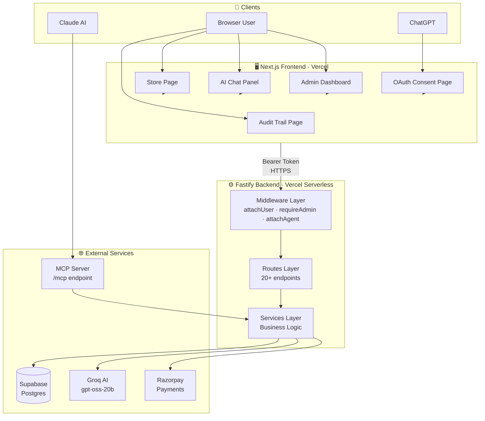
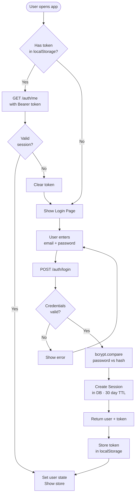
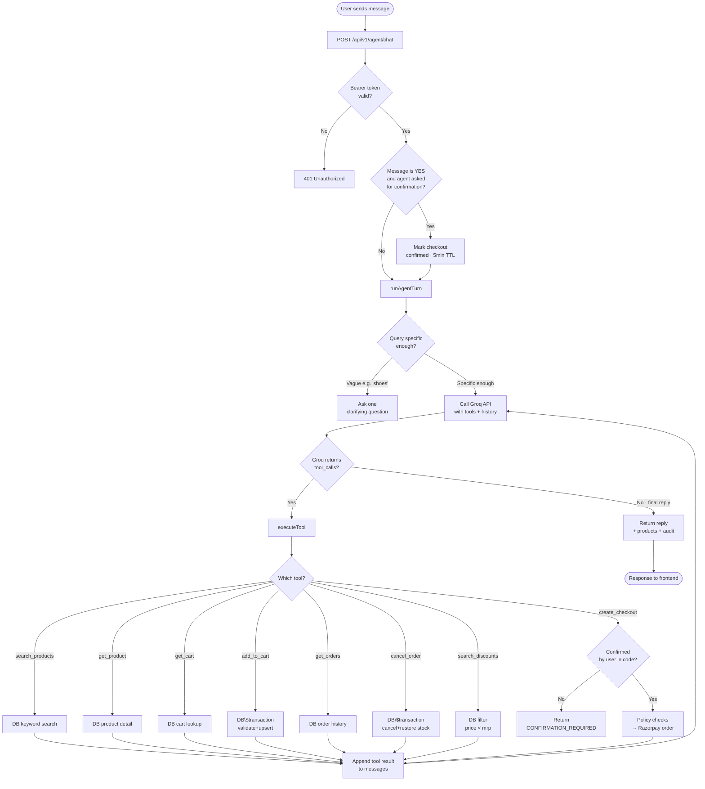
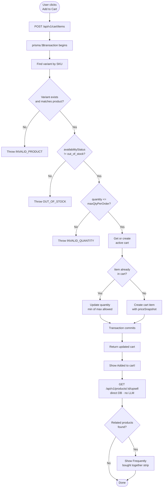
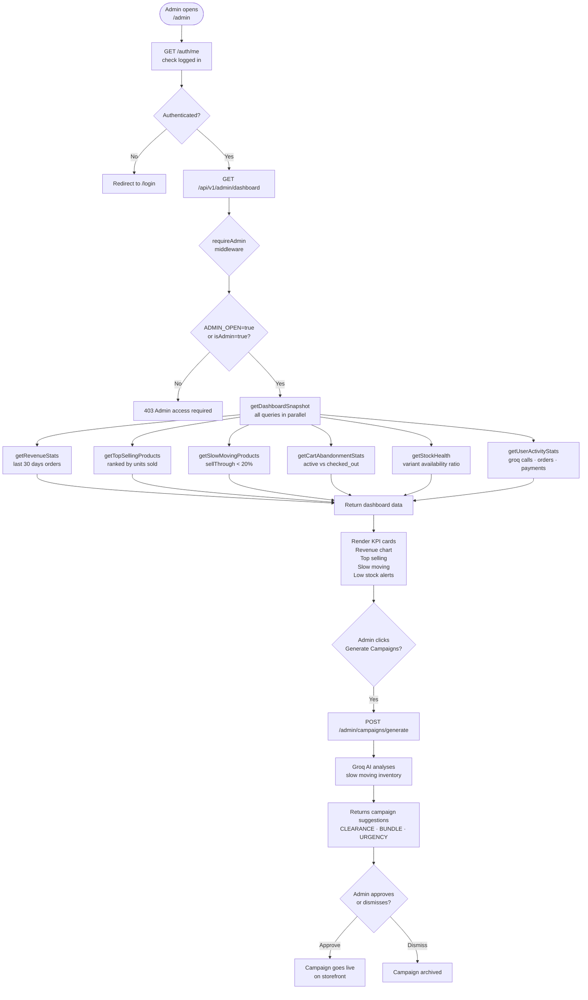

# Urban Store — System Flowcharts

> Open this file in VS Code with the **Markdown Preview** or install the **Mermaid Preview** extension to view the diagrams.

---

## 1. Overall System Flow

---

## 2. User Authentication Flow

---

## 3. AI Agent Chat Flow

---

## 4. Add to Cart Flow

---

## 5. Checkout & Payment Flow

---

## 6. OAuth Flow — Claude Connecting to Urban Store

---

## 7. Admin Dashboard Flow

---

## 8. Data Flow — Product Search to Order

```mermaid
flowchart LR
    A[urban_store_catalog.json\n504 products] -->|npm run seed\nbulk upsert 50 at a time| B[(Supabase DB\nproducts + variants)]

    B -->|keyword search\nPrisma findMany| C[Search Results]
    C -->|formatProduct\nprice · image · availability| D[Product Cards\nin frontend]

    D -->|user adds to cart\n$transaction| E[(cart_items\nwith priceSnapshot)]

    E -->|policy check\nRazorpay create| F[Checkout\n+ razorpayOrderId]

    F -->|payment success\n$transaction| G[(orders\nitemsJson snapshot)]

    G -->|getDashboardSnapshot| H[Admin Analytics\nRevenue · Top selling\nSlow moving]
```

